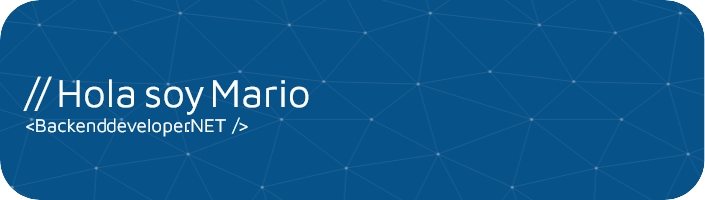

<h1 align="center">Hi 👋, I'm &lt; Mario/&gt; </h1>

# 💫 About Me: 
Welcome to my profile I am a .NET backend web developer
 
🌱 I’m currently learning Angular and Docker 💬 Ask me about C# | .NET 

## 🌐 Socials:
 
 

# 💻 Tech Stack:
 

# 📊 GitHub Stats:

